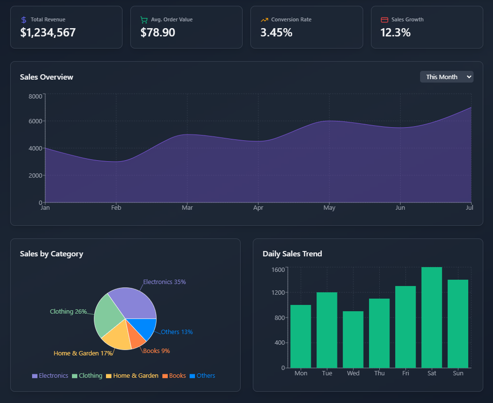

# Admin Dashboard

Un dashboard administrativo moderno y completo construido con React 19, TypeScript y Tailwind CSS. Ideal para mostrar habilidades advanced de frontend en un portfolio profesional.



**[Ver Demo →](https://admin-dashboard-ruby-nine-94.vercel.app/)**

## Tech Stack

| Tecnología | Propósito |
|------------|----------|
| [React 19](https://react.dev) | UI Framework con concurrent features |
| [TypeScript](https://www.typescriptlang.org) | Tipado estático |
| [Vite](https://vite.dev) | Build tool ultra-rápido |
| [Tailwind CSS](https://tailwindcss.com) | Styling utility-first |
| [Recharts](https://recharts.org) | Gráficos interactivos |
| [Framer Motion](https://www.framer.com/motion) | Animaciones fluidas |
| [Lucide React](https://lucide.dev) | Iconos |
| [React Router](https://reactrouter.com) | Navegación |

## Características

- **Dashboard Overview** — Métricas clave con tarjetas animadas y gráficos de tendencias
- **Analytics** — Análisis profundo con retención de usuarios, segmentación, e insights IA
- **Sales** — Seguimiento de ventas por categoría y canales
- **Products** — Gestión de productos con tabla interactiva
- **Users** — Tabla de usuarios con gráficos demográficos y heatmap de actividad
- **Orders** — Órdenes diarias con distribución visual
- **Settings** — Perfil, seguridad, notificaciones, cuentas conectadas, danger zone

### Highlights Técnicos

- Componentes completamente tipados con TypeScript
- Animaciones suaves con Framer Motion
- Gráficos profesionales con Recharts
- Diseño responsivo con Tailwind CSS
- Arquitectura limpia: páginas + componentes especializados
- Navegación con React Router

## Project Structure

```
src/
├── components/
│   ├── analytics/     # Componentes de Analytics
│   ├── common/       # Header, Sidebar
│   ├── orders/      # Componentes de Orders
│   ├── overview/    # Componentes de Overview
│   ├── products/   # Componentes de Products
│   ├── sales/      # Componentes de Sales
│   ├── settings/   # Componentes de Settings
│   └── users/      # Componentes de Users
├── pages/           # 7 páginas del dashboard
├── App.tsx          # Router principal
└── main.tsx         # Entry point
```

## Getting Started

```bash
# Clonar el proyecto
git clone https://github.com/didierpereira/admin-dashboard.git
cd admin-dashboard

# Instalar dependencias
npm install

# Iniciar dev server
npm run dev

# Build para producción
npm run build
```

## ¿Por qué este proyecto para tu portfolio?

Este dashboard demuestra:

1. **Control de React moderno** — Componentes, estado, efectos, concurrent features
2. **TypeScript en serio** — Tipado completo, sin `any`, interfaces bien definidas
3. **Tailwind CSS** — Diseño utility-first, consistencia, theming
4. **Visualización de datos** — Gráficos que cuentan historias, no solo adornan
5. **Animaciones que importan** — Framer Motion para UX, no solo decorado
6. **Arquitectura escalable** — Separación clara entre páginas y componentes

---

## Contacto

- **Portfolio**: [didier-portfolio.vercel.app](https://didier-portfolio.vercel.app/)
- **LinkedIn**: [linkedin.com/in/didierpereira](https://www.linkedin.com/in/didierpereira/)
- **GitHub**: [github.com/didierpereira](https://github.com/didierpereira)

¡Trabajás en un proyecto interesante? ¡Hablamos!¡